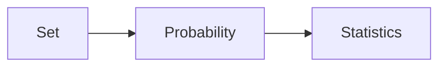

### Table of content  
>1. Set Theory
>2. Basic of probability theory
>3. Conditional probability and independence
>4. Random variables
>5. Distribution Function

-------
   
1.1 Set Theory  

> **Sample space** : the set s of all possible outcomes of a particular experiment, eg. coin $S = \{H, T\}$
>Once the sample space has been defined, then consider collections of possible outcomes of an experiment.
> **Event** : An event is any collection of possible outcomes of an experiment, that is any subset of S. eg. event $ A \subseteq S $

>!important. event A occurs if the outcome of the experiment  is in the set A.

> **Disjoint(mutually exclusive)** : two event A and B are disjoin, if ???  

> **Partition** : If $A_1,A_2, A_3, \cdots $ are pairwise disjoint and $ {\bigcup}_{i=1}^{\infty}A_i = S$, then the collection $A_1,A_2, A_3, \cdots $ forms a partition of $S$.  

1.2 Basic of probability theory

> eg. a, a, b, c ,b ,a ,c ,a  
> **'Frequency of occurrence'** can be thought as a probability.
>>Two way to make a definition       
>> 1.define in terms of $\cdots$     
>> 2.define term , which satisfy $\cdots$   

1.2.1 Axiomatic foundation
> For each event A in sample space S, associating with A a number between zero and one that will be called the probability of A, denoted by $P(A)$
>> **$\sigma$ algebra** (测度论) : a collection of subset of S is called a *$\sigma$ algebra*, denoted by $\beta$, which satisfies:
>>> a. $ \empty \in \beta$
b. If $ A \in \beta $ then $ A^c \in \beta $
c. If $A_1,A_2,\cdots \in \beta$, then ${\bigcup}_{i=1}^{\infty} A_i \in \beta$  

>**Probability function** : given a sample space S and an associate sigma algebra $\beta$ , a probability function is a function P with domain $\beta$ that satisfies:
>> 1. $P(A) \geq 0 $ for all $ A \in \beta $
>> 2. $P(S) = 1$
>> 3. If $A_1,A_2, \cdots \in \beta$ are pairwise disjoint, then $P({\bigcup}_{i=1}^\infty A_i) = \sum_{i=1}^\infty P(A_i)$  

>**Theorem** : let $S = \{s_{\tiny{1}},\cdots,s_n\}$, a finite set. Let $\beta$ be any sigma algebra of subset of $S$. Let $P_1, \cdots, P_n$ be nonnegative numbers that sum to 1 ($\sum_{i=1}^n P_i = 1$). For any $A \in \beta$, define $P(A)$:
$$P(A) = \sum\limits_{\{i: s_i \in A \} }s_i $$

>**Theorem** : if $P$ is a probability function and $A$ is any set in $\beta$, then:
>>a. $P(\emptyset) = 0$
b. $P(A) \leq 1$
c. $P(A^c) = 1 - P(A)$  

>**Theorem** : if $P$ is a probability function , $A, B$ is any set in $\beta$, then:
>>a. $P(B \cap A^c) = P(B) - P(A \cap B)$
>>b. $P(A \cup B) = P(A) + P(B) - P(A \cap B)$
>>c. If $A \subseteq B$ then $P(A) \leq P(B)$
>>> tips : n choose r :${n \choose r} = \frac{n!}{r!(n-r)!}$ 

1.3 Conditional probability and independence 
>**Conditional probability** : If $A$ and $B$ are event in $S$ and $P(B)>0$. Then, the conditional probability of $A$ given $B$, writen $P(A|B)$, is:
$$P(A|B) = \frac{P(A \cap B)}{P(B)}$$
>**Bayes Rule**:
$$P(A|B) = P(B|A)\frac{P(A)}{P(B)}$$
more general form with partition of the sample space
>**Theorem**: let $A_1,A_2,\cdots$ be a partition of sample space, and let B be any set. Then for each $i= 1,2,\cdots$
$$P(A_i|B) = \frac{P(B|A_i)}{P(A_i)\sum\limits_{j=1}^\infty P(B|A_j)P(A_j)}$$

>**Independent**: two events $A, B$ are statistically independent if:
$$P(A \cap B) = P(A)P(B)$$  

1.4 Random variables
> *opinion poll*
>> *50 people whether agree or disagree*
>> *sample space size : $2^{50}$*

>**essence, essential**
>> only  quantity of interest is the number of agree
>> so define $X$: the number of ones records

>> sample space of $X$ is the set of integers $\{0,1,2,\cdots, 50\}$

> **Random variable** : a random variable is a function from a sample space $S$ into the real number.
>> so define $X$: the number of ones records

1.5 Distribution Function
> **Cumulative distribution function(cdf)**: with every random variable $X$, associate a function called the cumulative distribution function of X. Denoted by $F_X(x) = P_X(X\leq x)$, for all $x$.
>> *Cdf is right continuous*

---
<h2>Reference</h2>

[Casella, G., Berger, R. L. (2002). Statistical Inference]